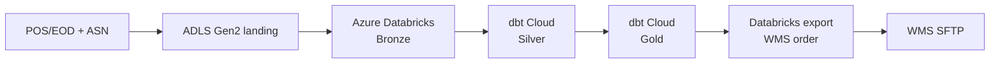

# Trade Day Close to Store Replenishment

A retail DataOps demonstration of one Azure Databricks/dbt Cloud data plane
orchestrated independently by Apache Airflow and Control-M.

The scenario is fictional and industry-informed. Store counts, thresholds,
calendar policy, timings and integration boundaries are demo assumptions—not
statements about Kmart production systems.

## What the demo shows

For a trading date, 325 simulated stores publish POS transactions and EOD markers
to Redpanda while a supplier publishes an ASN to Azure storage. The flow validates
and ingests the sources into Databricks Bronze, uses dbt Cloud to build/test Silver
and Gold, exports a replenishment order, and delivers it to a WMS SFTP simulator.



The same stages are exposed through two control planes:

- **Airflow** demonstrates Python-native orchestration, rescheduling readiness
  sensors and real Databricks/dbt Cloud provider tasks. Its flow ends at delivery.
- **Control-M** demonstrates event/file convergence, cross-platform ownership,
  native dbt Cloud jobs, downstream acknowledgement and a 06:00 service SLA.

Neither invokes the other and neither contains a private implementation of the
business stages. The intended conclusion is coexistence: Airflow is strong in the
data-engineering domain, while Control-M can govern the wider business service.

## Data architecture

Bronze, Silver and Gold are physical schemas/objects in Azure Databricks:

| Layer | Objects |
|---|---|
| Bronze | Six Delta source tables written by `00_ingest_bronze` |
| Silver | Four dbt staging views and two dbt intermediate Delta tables |
| Gold | Four tested dbt marts including replenishment need |

There is no PostgreSQL business-data store, Azurite boundary, local Databricks
surrogate or local dbt execution. Airflow uses SQLite only for its own standalone
demo metadata.

See [Architecture](docs/ARCHITECTURE.md), [Operations](docs/OPERATIONS.md), the
[presentation runsheet](docs/RUNSHEET.md), and the detailed
[23-minute talk track](talktrack.md).

## Local and external components

`docker-compose.yml` starts the local simulation/control-plane services:

- Redpanda and Redpanda Console;
- the Kafka-backed EOD readiness projector;
- WMS SFTP and acknowledgement writer;
- Airflow 3.3 standalone; and
- an on-demand Python toolbox.

The business data and transformations run in real external services:

- ADLS Gen2;
- Azure Databricks;
- dbt Cloud; and
- the connected Control-M tenant/host Agent for the Control-M path.

## Quick start

Prerequisites and cloud provisioning are detailed in `docs/OPERATIONS.md`. The
short version is:

```bash
make prepare
# Populate the ignored .env with Azure, Databricks and dbt Cloud values.
make install-databricks-cli
databricks auth login \
  --host https://WORKSPACE.azuredatabricks.net \
  --profile retail-demo-azure
make databricks-provision
make dbt-cloud-publish
make dbt-cloud-provision
make up
make health
```

Provisioning creates external/billable resources and is intentionally separate
from normal runs.

Run Airflow:

```bash
make reset DATE=2026-08-14
make demo-airflow DATE=2026-08-14
```

Run Control-M after its workflow/profile has been explicitly deployed:

```bash
make reset DATE=2026-08-14
make demo-controlm DATE=2026-08-14
```

Do not run the two control planes concurrently against the same trading date;
both deliberately replace the same deterministic targets.

## Shared stage interface

The business data plane can be proved without either orchestrator:

```bash
make seed DATE=2026-08-14
make eod-readiness-arm DATE=2026-08-14
make simulate DATE=2026-08-14
make stage-inputs DATE=2026-08-14
make databricks-ingest DATE=2026-08-14
make dbt-stage DATE=2026-08-14
make dbt-intermediate DATE=2026-08-14
make dbt-gold DATE=2026-08-14
make databricks-export DATE=2026-08-14
make deliver DATE=2026-08-14
make gate-ack DATE=2026-08-14
```

`stage-inputs` writes the active simulation generation and a manifest to
`landing/trading_date=YYYY-MM-DD/`. The ingest notebook validates every header,
checksum, row count and date window before writing Bronze. The output name is
always `REPLEN_ORDER_YYYYMMDD.csv`.

## Store readiness policy

| Completeness | Decision |
|---:|---|
| 100% | `PROCEED` |
| at least 99.5%, with missing stores | `PROCEED_WITH_EXCEPTIONS` |
| 98.0% to below 99.5% | `PROCEED_WITH_TRADE_OPS_ALERT` |
| below 98.0% | `HOLD` |

The readiness projector stores generation state in compacted Kafka topics. The
BMC Event Handler maps the resulting neutral event to Control-M; it does not
calculate the policy.

## Failure demonstrations

```bash
make fail-1 STORES=1 DATE=2026-08-14
make fail-1 STORES=8 DATE=2026-08-14
make fail-2 DATE=2026-08-14
make fail-3 DATE=2026-08-14
make fail-4 ROWS=400 DATE=2026-08-14
make fail-5 SECONDS=45
make wms-never-ack
make wms-reject
make reset DATE=2026-08-14
```

Failed gates intentionally return non-zero. `make reset` restores source modes and
snapshots for the date without deleting or rerunning remote job history.

## Validate and stop

```bash
make lint
make test
make down
```

`make clean` is destructive: it removes local named volumes, including Redpanda,
WMS and Airflow metadata. It does not delete Azure Databricks or dbt Cloud
resources.

## Honest boundaries

- Azure Databricks and dbt Cloud are real; Redpanda sources and WMS are demo
  simulations.
- Airflow standalone with SQLite is a packaging choice for this one-user demo,
  not a production Airflow recommendation.
- The default Databricks cluster is small and auto-terminating; this is not a
  performance benchmark.
- Schema drift is an explicit source-manifest contract plus dbt tests, not an
  unimplemented native Control-M Data Assurance feature.
- Control-M SLA prediction becomes useful only after the connected tenant has
  successful history.
- `controlm/descriptors/prod.json` contains placeholders and must not be deployed
  as-is.
