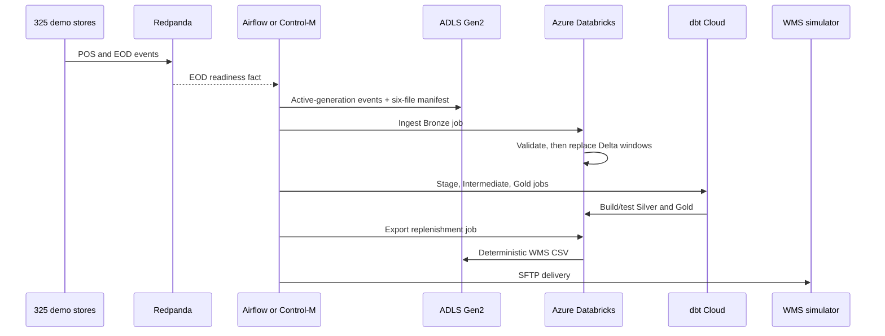

# Demo explainer

## The short version

This demonstration follows a fictional retailer from trade-day close to a store
replenishment order. POS and store-close events arrive through Redpanda, a
supplier ASN arrives in Azure storage, Azure Databricks owns Bronze/Silver/Gold,
dbt Cloud owns transformations and tests, and the final order is delivered to a
WMS SFTP simulator.

Airflow and Control-M are two independent control planes over that same data
plane. Airflow shows a data-engineering orchestration experience and ends after
delivery. Control-M shows a wider business-service view and continues until the
WMS acknowledges the file and the 06:00 SLA is measured.

## Why the architecture is credible

There is no PostgreSQL bridge or duplicate local medallion implementation to
explain. Every stage has one owner:

- Redpanda and generators simulate upstream systems.
- ADLS Gen2 is the replayable file boundary.
- Azure Databricks validates sources and owns Delta execution.
- dbt Cloud builds and tests Silver/Gold.
- Airflow and Control-M own dependency/retry/operational policy.
- WMS SFTP simulates downstream delivery and acceptance.

Bronze, Silver and Gold are Databricks schemas and objects. Airflow's SQLite file
is only internal metadata for its single-container demo runtime.

## Business flow

## How the Event Handler changes the story

The EOD projector maintains generation state in the compacted topic
`retail.store-eod-readiness-state.v1`. It publishes the neutral event
`RETAIL_EOD_READY_20260814` only after the configured completeness policy is
satisfied. The BMC Event Handler maps that event into Control-M; it does not query
a database or calculate retail policy.

Airflow observes the same Kafka-backed readiness state with a rescheduling sensor.
This preserves a fair comparison: the source fact is shared while each
orchestrator uses its own integration style.

## What the landing contract proves

The local broker cannot be reached directly from Azure Databricks, so
`StageInputsToAzure` is a small transport adapter. It reads a bounded high-watermark
snapshot for the active `simulation_id`, writes POS/EOD CSVs, verifies the four
other source objects, and publishes `manifest.json` last.

`00_ingest_bronze` validates:

- the exact six-table manifest;
- each exact ordered header;
- SHA-256 and row count;
- required/non-null parse results; and
- the correct trading-date replacement window.

Only after those checks does it write Bronze Delta. dbt then applies business
quality tests such as non-negative stock and replenishment ranges.

## Airflow talk track

1. Show the two rescheduling readiness sensors.
2. Show `stage_inputs_to_azure` and the real Databricks ingest provider task.
3. Show three dbt Cloud provider tasks using the shared job IDs.
4. Show the Databricks export and WMS delivery.
5. Call out that the DAG ends at delivery because this view represents the data
   engineering responsibility.

## Control-M talk track

1. Show the EOD event and ASN File Watcher converging.
2. Show the same landing adapter and Databricks ingest job.
3. Show the three native `Job:DBT` tasks and corresponding dbt Cloud runs.
4. Show the same export/delivery contract.
5. Continue to the ACK File Watcher and `SLA_PickWave`.
6. Explain that the additional steps express wider service ownership, not a
   different data pipeline.

## Three-to-five-minute demo explanation

> We are closing trade for a fictional 325-store retailer. Store POS and close
> markers arrive through Kafka, while the supplier ASN arrives independently in
> Azure storage. We wait for those two facts to converge, then snapshot only this
> run's Kafka generation and publish a manifest.
>
> Azure Databricks validates the entire source contract and writes six Bronze
> Delta tables. dbt Cloud then runs the shared Stage, Intermediate and Gold jobs
> against Databricks. A second Databricks job exports a deterministic
> replenishment CSV and the same adapter delivers it to WMS.
>
> Airflow and Control-M orchestrate those exact same jobs. Airflow gives the data
> team Python-native sensors and provider tasks and ends at delivery. Control-M
> continues across the downstream acceptance boundary, waits for WMS
> acknowledgement, and measures the complete service against 06:00. The conclusion
> is coexistence around one data plane, not two competing implementations.

## Honest claims

- The retail scenario and thresholds are fictional.
- Azure Databricks and dbt Cloud are real external services; upstream and WMS are
  simulations.
- The small auto-terminating cluster is not a performance benchmark.
- Airflow standalone with SQLite is not production architecture guidance.
- The explicit manifest/schema checks are implemented; native Control-M Data
  Assurance is not.
- SLA prediction needs successful history in the connected Control-M tenant.
