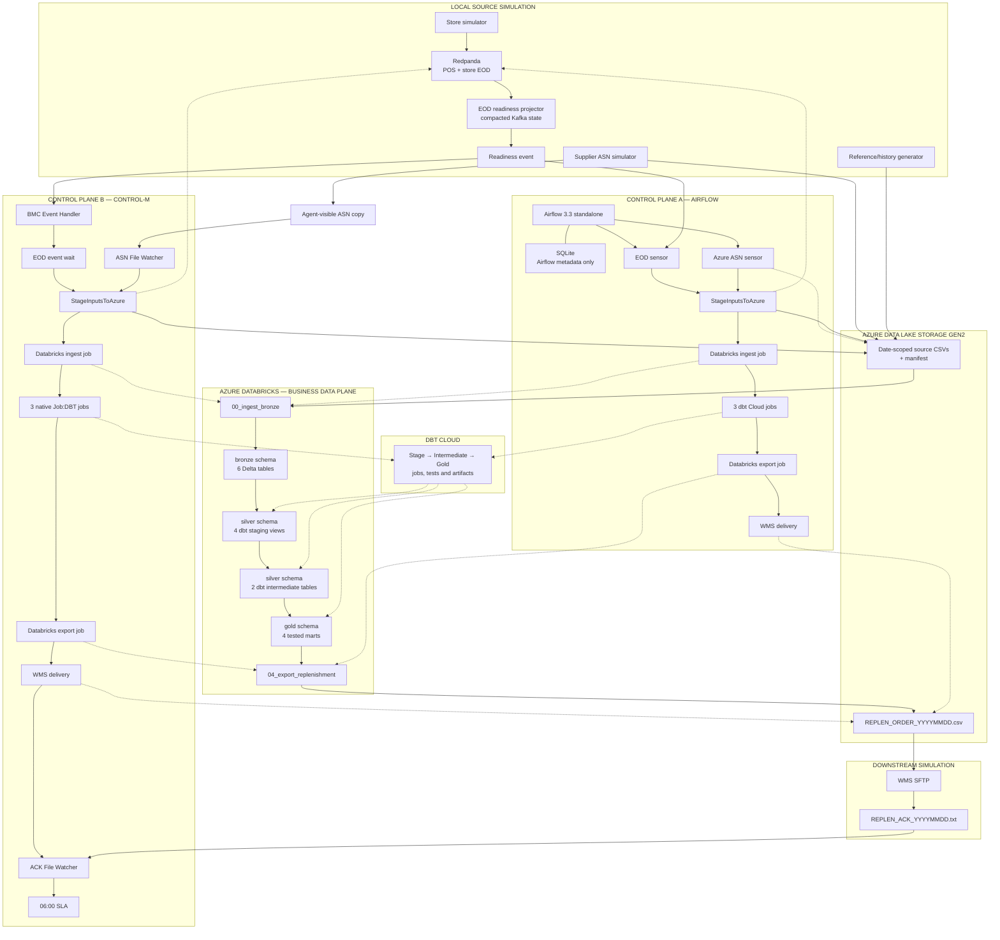
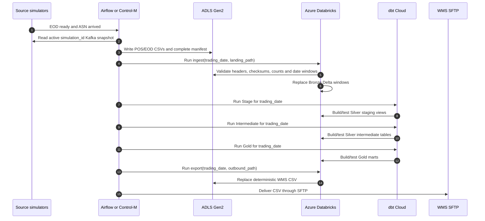

# As-built architecture and trust boundaries

> **Status:** Implemented on `feature/databricks-dbt-cloud-data-plane`.
>
> This document is the single architecture source of truth for the demo.

## Architecture decision

The demo has one business-data implementation: Azure storage and Delta objects in
Azure Databricks. dbt Cloud connects to that Databricks workspace. PostgreSQL,
Azurite, the local Databricks Jobs API surrogate and local dbt execution are not
part of the runtime.

Airflow and Control-M are independent control planes over the same data plane.
They invoke the same source adapter, two Azure Databricks jobs, three dbt Cloud
jobs and WMS delivery implementation. Neither invokes the other, and neither owns
business transformation logic.

Airflow ends after the order is delivered to WMS. Control-M continues through WMS
acknowledgement and the 06:00 service SLA. That deliberate boundary is the main
comparison.

## Why this architecture

The earlier self-contained profile used PostgreSQL as the business-data store,
Azurite as a local object boundary, a Jobs API-compatible local service in place
of Databricks, and local dbt execution. That profile obscured the two points the
demo needs to make:

- dbt Cloud, Airflow and Control-M should all operate against the same real
  Databricks implementation; and
- the comparison should be about orchestration and operational ownership, not
  about explaining two different business-data paths.

The implemented profile therefore gives every stage one owner:

| Responsibility | Owner |
|---|---|
| POS and store-EOD event transport | Local Redpanda source simulator |
| Supplier, reference and history generation | Local Python source simulators |
| Replayable source and outbound file boundary | ADLS Gen2 |
| Source-contract validation and Bronze ingestion | Azure Databricks |
| Silver and Gold transformations and tests | dbt Cloud against Azure Databricks |
| Replenishment export | Azure Databricks |
| Pipeline orchestration | Airflow or Control-M, independently |
| Downstream receipt and acknowledgement | Local WMS SFTP simulator |

ADLS Gen2 replaces Azurite intentionally. An Azure Databricks workspace can use
the same ADLS objects directly, whereas retaining the host-local emulator would
require a separate Azurite-to-ADLS copy bridge and leave two object stores in the
story. The trade-off is that this profile is cloud-backed rather than fully
self-contained: the Azure storage container, Databricks workspace and dbt Cloud
project must exist before a complete run.

## Component view



Bronze, Silver and Gold in this diagram are Databricks schemas and objects. They
are not local tables. Persisted Bronze, Silver-intermediate and Gold objects use
Delta; Silver staging resources are views.

## Deployment boundaries

The runtime deliberately spans local simulation and real cloud services:

| Boundary | Components | Persistence |
|---|---|---|
| Local Compose | Redpanda, readiness projector, WMS SFTP/ack writer, Airflow standalone, on-demand toolbox | Named volumes and ignored runtime state |
| Azure | ADLS Gen2 and Azure Databricks compute/Delta tables | Azure-managed storage |
| dbt Cloud | Deployment environment and Stage, Intermediate and Gold jobs | dbt Cloud metadata and run artifacts |
| Host | Enrolled Control-M Agent, Automation API CLI and BMC Event Handler | Host/platform configuration outside the repository |

The local Compose topology contains no PostgreSQL, Azurite, continuous
Kafka-to-database ingest service, local dbt runtime or Databricks Jobs API
surrogate. Airflow's SQLite database is control-plane metadata only and never
stores retail data.

## Shared processing contract



`StageInputsToAzure` is a transport adapter required because the local Redpanda
broker is not reachable from the Azure workspace. It selects only the active
`simulation_id`, takes a bounded Kafka high-watermark snapshot, writes the two
event CSVs, verifies all six source objects, and publishes the manifest last. It
does not transform business data or keep a second local business-data store.

The six landing objects are `product_master.csv`, `pos_transactions.csv`,
`store_eod.csv`, `asn_inbound.csv`, `stock_on_hand.csv` and
`sales_history.csv`. Reference, stock, history and ASN objects are written by the
source simulators. `StageInputsToAzure` adds the bounded POS and EOD snapshots,
then publishes `manifest.json` only after all six objects have been verified.

## Control-plane mappings

Both control planes pass the trading date explicitly and invoke the same cloud
job IDs generated during provisioning. Their differences are visible orchestration
choices, not different business transformations.

| Shared capability | Airflow | Control-M |
|---|---|---|
| Cloud configuration guard | `validate_cloud_configuration` | Rendered descriptors and connection profiles |
| Store readiness | Rescheduling Python sensor | Kafka-derived event wait through BMC Event Handler |
| Supplier readiness | Rescheduling Azure-object sensor | Native File Watcher over the host-visible ASN copy |
| Azure landing | Python operator calling `StageInputsToAzure` | Host command calling the same adapter |
| Bronze ingest and export | Databricks provider `run-now` operators | Host commands invoking the same provisioned Databricks jobs |
| Silver and Gold | Three dbt Cloud provider operators | Three native `Job:DBT` jobs |
| WMS delivery | Python operator calling the shared adapter | Host command calling the shared adapter |
| WMS acknowledgement and SLA | Deliberately out of scope | Native ACK File Watcher and `SLA_PickWave` |

The Airflow DAG is manual by default, limits itself to one active run and uses
provider-native Databricks and dbt Cloud operators. The Control-M Agent remains
outside Compose because its host identity belongs to the connected tenant. The
two control planes must not call each other.

## Physical layers

| Layer | Physical location | Objects |
|---|---|---|
| Landing | ADLS Gen2 | Six CSVs plus `manifest.json` under `landing/trading_date=YYYY-MM-DD/` |
| Bronze | Azure Databricks `bronze` | `product_master`, `pos_transactions`, `store_eod`, `asn_inbound`, `stock_on_hand`, `sales_history` |
| Silver staging | Azure Databricks `silver` | Four dbt views |
| Silver intermediate | Azure Databricks `silver` | `int_daily_sales_by_store_sku`, `int_stock_on_hand` |
| Gold | Azure Databricks `gold` | `dim_product`, `fct_stock_position`, `fct_sell_through`, `fct_replenishment_need` |
| Outbound | ADLS Gen2 | `outbound/REPLEN_ORDER_YYYYMMDD.csv` |

The ingest notebook validates the complete manifest and every CSV before its first
Delta write. It checks the exact ordered header, SHA-256, row count, required
values and replacement date window. `product_master` is a whole-snapshot replace;
the other five tables replace deterministic date windows with Delta
`replaceWhere`. Repeating a trading date replaces the same targets.

Important logical keys are `transaction_id`, `(store_id, trading_date)`,
`(asn_id, product_sku)`, `(store_id, product_sku, snapshot_date)` and
`(sale_date, store_id, product_sku)`. dbt tests enforce the model-level uniqueness,
not-null and accepted-range contracts checked into `models/schema.yml`.

The dbt Stage job builds four date-filtered Silver views. Intermediate and Gold
jobs rebuild their deterministic table results for the supplied trading date.
The export notebook sorts by store and SKU, generates stable order IDs, and
overwrites `REPLEN_ORDER_YYYYMMDD.csv`; delivery uses that same filename. These
rules make a same-date rerun converge on the same logical results.

## Implemented stage and provisioning interface

The orchestration-neutral processing chain is exposed through these Make targets:

```bash
make seed DATE=2026-08-14
make eod-readiness-arm DATE=2026-08-14
make simulate DATE=2026-08-14
make gate-eod DATE=2026-08-14
make gate-asn DATE=2026-08-14
make stage-inputs DATE=2026-08-14
make databricks-ingest DATE=2026-08-14
make dbt-stage DATE=2026-08-14
make dbt-intermediate DATE=2026-08-14
make dbt-gold DATE=2026-08-14
make databricks-export DATE=2026-08-14
make deliver DATE=2026-08-14
```

Cloud provisioning is deliberately separate from normal pipeline execution:

```bash
make databricks-provision
make dbt-cloud-publish
make dbt-cloud-provision
```

`make demo-airflow` and `make demo-controlm` operate the two paths; neither
provisions billable Azure resources, publishes dbt code, deploys a Control-M
workflow or orders the other control plane as a hidden side effect.

## Runtime state that is not business data

| State | Location | Purpose |
|---|---|---|
| Airflow SQLite | named volume `airflow-state` | DAG runs, task instances and UI state only |
| EOD projector state | compacted Redpanda topics | generation and unique-store readiness |
| Generated cloud IDs | ignored `runtime/databricks/azure.json` and `runtime/dbt_cloud/azure.json` | Job/environment identifiers without tokens |
| Demo modes and snapshots | ignored `runtime/state/` | reversible failures, active simulation ID and WMS claims |
| File Watcher copies | ignored `runtime/asn/` and `runtime/wms/` | host-visible source and acknowledgement files |

The enrolled Control-M Agent and BMC Event Handler remain outside Compose. Their
credentials stay on the host or in their connected platform. Azure, Databricks and
dbt Cloud secrets stay in `.env`, user authentication stores, a Databricks secret
scope or the platform connection profile; none are written to generated state.

## Honest boundaries

- The source and WMS systems are simulations; Azure Databricks and dbt Cloud are
  real external services in this profile.
- Airflow SQLite is acceptable only for this single-user presentation package,
  not as a production Airflow metadata design.
- The Databricks cluster is a small auto-terminating demo cluster using the legacy
  Hive Metastore unless the environment is deliberately upgraded.
- Schema drift is implemented by the manifest/ingest contract and dbt tests. Do
  not claim an unimplemented native Control-M Data Assurance feature.
- Useful Control-M SLA prediction requires successful execution history.
- Retail thresholds, calendars, volume and estate are fictional demo assumptions.
