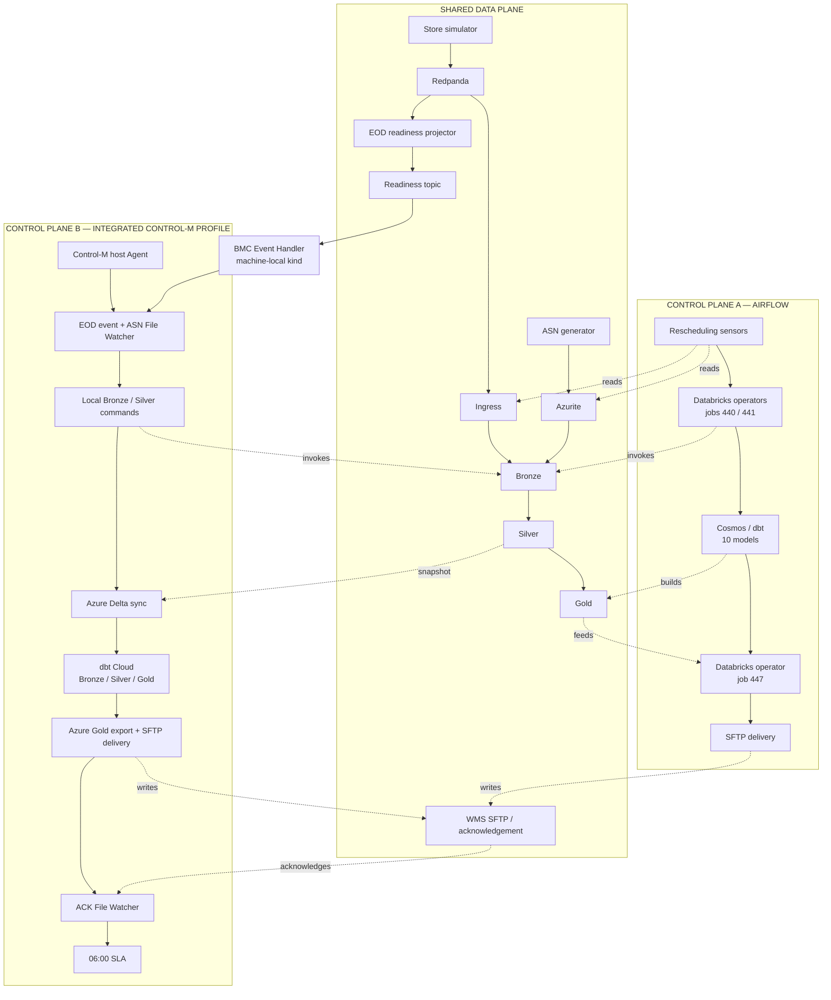

# Architecture and trust boundaries

The generators, database transforms, local Jobs API and WMS contain no schedule,
dependency, retry or next-step choice. Continuous Kafka ingress and the WMS watcher
are transport adapters. The EOD projector emits an orchestrator-neutral readiness
fact; only the separate BMC Event Handler translates that fact into a Control-M
event.

The enrolled Control-M Agent is the intentional host execution boundary because its
identity already belongs to the SaaS tenant. `controlm/systemd/controlm-agent.service`
keeps that identity running across reboots, and every host command job enters the
local application through `controlm/scripts/run_stage.sh`; native `Job:DBT` work
instead crosses directly to dbt Cloud. The BMC Event Handler is a second external
integration boundary: it runs in the machine-local kind cluster, consumes the
committed readiness topic, and calls Control-M `setevent`. The optional integrated
profile also crosses explicit Azure Databricks and dbt Cloud account boundaries.
None of those external identities or credentials are copied into the Compose
images.

## Compose services and persistence

| Service | Responsibility | State / mount |
|---|---|---|
| `redpanda` | Kafka-compatible event transport | `redpanda-data` |
| `redpanda-console` | Topic/operator view | none |
| `azurite` | Azure Blob-compatible file store | `azurite-data` |
| `postgres` | Ingress, bronze, silver, staging, intermediate, gold, demo metadata and the Airflow database | `postgres-data` |
| `kafka-init` / `blob-init` | One-shot topic and Blob-container initialization | Redpanda / Azurite |
| `kafka-ingest` | Continuous, idempotent event landing | Postgres |
| `eod-readiness` | Unique-store threshold projection | compacted Kafka state topic |
| `databricks-local` | Jobs API and independently triggerable stages | Postgres/Blob |
| `wms-sftp` | Downstream SFTP boundary | `wms-data` |
| `wms-ack-writer` | Configurable ack/reject behaviour | `wms-data` / Postgres |
| Airflow init/API/scheduler/DAG processor/triggerer | Control plane A only | Postgres plus `airflow/logs` and `airflow/config` host binds |
| `toolbox` | On-demand operator CLI and dbt execution | shared repository/runtime binds |

## Idempotency keys

| Stage | Key / replacement rule |
|---|---|
| Kafka ingress | deterministic event ID |
| EOD readiness | explicit arm generation; transactional state and public event |
| Bronze POS | `transaction_id` |
| Bronze/silver EOD | `(store_id, trading_date)` |
| Bronze ASN raw | `trading_date` |
| Silver ASN | replace the trading-date partition; `(asn_id, product_sku)` |
| Optional Azure silver bridge | whole reference replacement; date-window `replaceWhere` for five Delta sources |
| dbt | tables/views replace atomically |
| Azure replenishment export | deterministic date path, order IDs, sorted lines, and atomic host replacement |
| WMS delivery | deterministic filename; repeat delivery overwrites the same remote path |

## Event-driven EOD boundary

The projector consumes per-store markers and an explicit arm command. It maintains
one compacted state record per trading date. Each consumed marker/command commits
its resulting state and source offset in one Redpanda transaction; a 100% marker
also includes the public event. For an eligible incomplete day, the later quiet-window
transaction contains the updated emitted state and public event but no source offset,
because the triggering marker offset was already committed with its state. The BMC
consumer uses `isolation.level=read_committed`, so an interrupted transaction is
never converted into `setevent`. A single projector replica owns the cross-partition
325-store aggregate; a production multi-replica implementation would repartition
by trading date or use a Kafka Streams-compatible state store.

This provides idempotent publication by the demo application, not an end-to-end
exactly-once claim. BMC documents that the Event Handler itself does not support
idempotency; a handler failure after the API call but before its Kafka offset commit
can retry the action. The deterministic Control-M event name/date and one handler
replica constrain that residual failure mode.

Arming is deliberate. It starts an empty generation for a date, which allows the
same replay date to be demonstrated again without old immutable EOD messages
releasing Control-M before the audience sees the live events. The projector counts
configured fictional store IDs and applies the shared percentage classifier; it
does not query or persist state in Postgres. A 100% result emits immediately. An
incomplete but eligible result waits for a configurable three-second unique-marker
quiet window, preventing a normal 325-store stream from being reported at its
transient 319-store state.

## Local versus Azure profile

The default profile uses Azurite and a Jobs API-compatible service so a presenter
can run the whole local data plane from Compose without an Azure Databricks or dbt
Cloud connection. The optional host adapter under `databricks/` copies the six
validated `silver` sources into real Delta tables for one explicit date. It is not
part of `docker-compose.yml` and does not replace the local input gates or
pre-silver contract. The integrated Control-M profile activates this adapter,
triggers three pre-existing dbt Cloud jobs through native `Job:DBT`, and exports
the tested Azure Gold result back through the shared WMS contract. The tagged job
labels are presentation zones: Bronze is four staging views over the validated
Delta handoff, Silver is two intermediate tables, and Gold is four marts. Bronze
does not read Kafka directly. Only `DbtGold` currently has an automatic Control-M
rerun action: up to two one-minute retries from its point of failure.

Airflow's actual `DatabricksRunNowOperator` calls the local surrogate through
`AIRFLOW_CONN_DATABRICKS_DEFAULT=databricks-local:8000` with a demo-only token.
There is no Azure workspace connection in the default Compose or Airflow profile,
and no settings were copied from the host Airflow installation. Azure CLI OAuth,
dbt Cloud service/deployment credentials, and Control-M Agent identity remain
host/account concerns and are never written to the Compose images.
