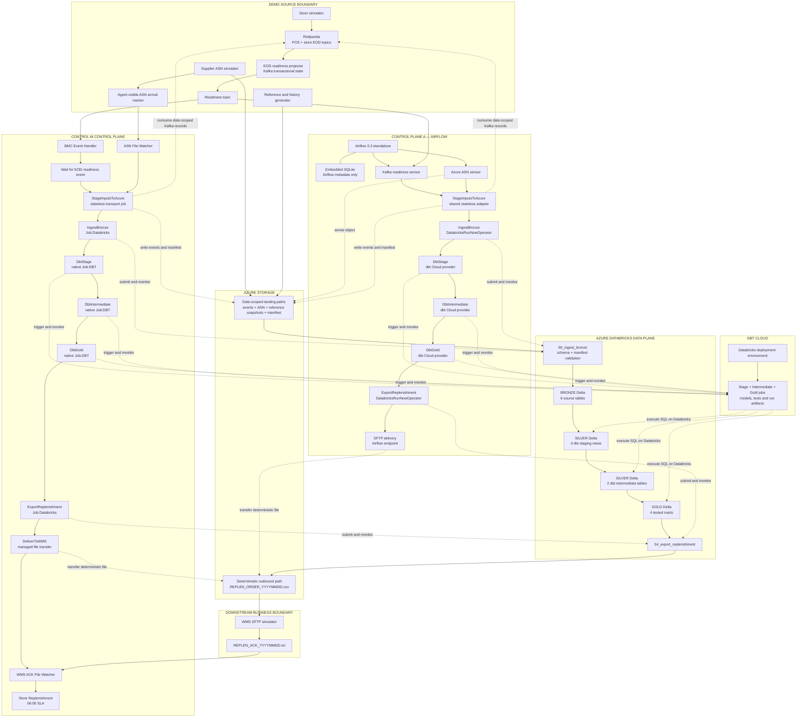
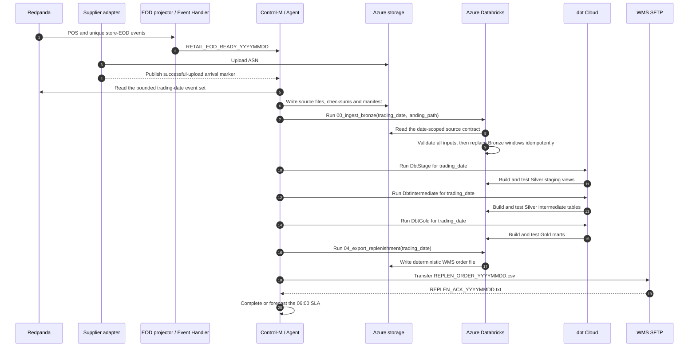
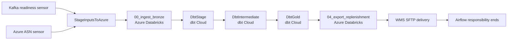
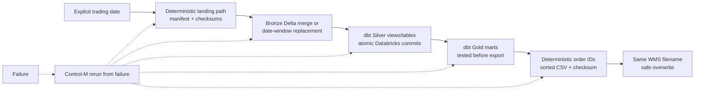
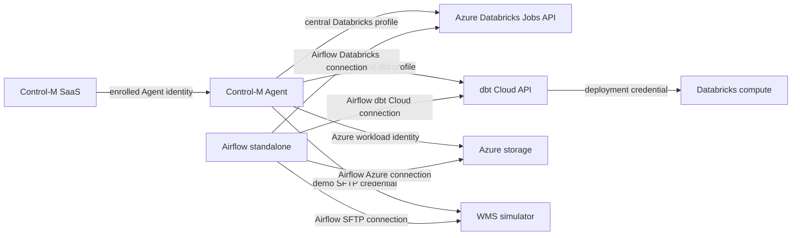

# Target architecture — Azure Databricks and dbt Cloud

> **Status: proposed target state, not the current implementation.**
>
> This document describes the architecture to implement before presenting the
> Databricks/dbt Cloud profile as the primary demo. The current repository still
> contains a Postgres-based local profile and a Postgres-to-Databricks bridge.
> Those components must be removed or replaced before this document becomes the
> as-built architecture.

## Architecture decision

The target demo has one persistent business-data plane: Azure storage and Delta
tables in Azure Databricks. dbt Cloud connects only to Azure Databricks. There is
no Postgres database, no local Jobs API surrogate, and no duplicate local
Bronze/Silver/Gold implementation.

Two independent control planes orchestrate that same data plane. Airflow owns its
workflow from source readiness through WMS delivery. Control-M owns its separate
workflow from source readiness through WMS acknowledgement and the 06:00 pick-wave
SLA. Neither control plane invokes the other. Databricks notebooks and dbt models
remain independently rerunnable data-processing units; they contain no schedule,
dependency, retry or downstream orchestration decisions.

The local components retained for the demonstration are source and downstream
simulators:

- Redpanda publishes POS transactions and store EOD markers.
- The supplier simulator publishes the ASN to the Azure landing container and
  writes an agent-visible arrival marker for the Control-M File Watcher.
- A stateless landing adapter writes one deterministic, date-scoped Kafka snapshot
  and manifest to Azure storage. It does not transform or persist business data
  locally.
- The WMS SFTP service receives the order and writes an acknowledgement file.
- The EOD readiness projector keeps its replay state in a compacted Kafka topic.
- A single-container Airflow 3.3 standalone runtime stores only its own demo
  control-plane metadata in an embedded SQLite file.

Airflow is part of the target runtime and must be migrated with the data plane. Its
Databricks connection points to the real Azure workspace, and its dbt tasks trigger
the same pre-existing dbt Cloud jobs as Control-M. The current Cosmos/local-dbt
task group is therefore replaced by dbt Cloud provider tasks. This deliberately
trades ten per-model Cosmos tasks for a fair comparison in which both control
planes monitor the same three remote dbt jobs.

Airflow still requires an internal metadata store. For this local, single-user
demo, the target uses the pinned Airflow 3.3 `standalone` runtime with an embedded
SQLite file on an Airflow-only volume. That file contains DAG runs, task instances
and UI state—never retail events, medallion data, WMS state or transformation
results. It is a demo packaging choice, not a recommended production Airflow
database. There is no Postgres service or connection string in the target stack.

## Target component and trust-boundary view

There is no database between Redpanda/Azure storage and Databricks. The
`StageInputsToAzure` job is only a transport boundary needed because the local
Redpanda broker is not directly reachable from the Azure workspace. Its outputs
are immutable or deterministically replaceable files plus a manifest; it has no
query engine and creates no second source of truth. The supplier arrival marker is
written only after the Azure upload succeeds and identifies the object path and
checksum that the downstream manifest must contain. Airflow and Control-M invoke
the same adapter implementation with the same trading-date contract.

## End-to-end Control-M service

Every remote submission is synchronous from Control-M's perspective: Control-M
waits for the Databricks or dbt Cloud run result and prevents downstream work when
the remote job or a data test fails. Retry policy and service forecasting belong
to Control-M; transformation SQL belongs to dbt Cloud; Spark/Delta execution
belongs to Azure Databricks. Airflow's remote operator tasks also wait for the same
Databricks and dbt Cloud results and enforce the same downstream gates.

## Equivalent Airflow workflow

The Airflow DAG uses the real Azure Databricks provider for notebooks `00` and
`04`, dbt Cloud provider tasks for the three pre-existing jobs, and an Azure object
sensor for the ASN. Its readiness sensor observes the same Kafka fact that the BMC
Event Handler maps into a Control-M event. It does not query Databricks repeatedly
to infer whether store EOD is complete.

Airflow deliberately stops after successful WMS delivery. Control-M deliberately
continues through acknowledgement and SLA measurement. That difference is the
comparison; the source data, notebooks, dbt project, remote dbt jobs, Delta tables
and WMS file are identical.

## Physical data layers

Bronze, Silver and Gold are schemas and data objects in Azure Databricks—not labels
for local tables and not separate databases in different products. Persisted
tables use Delta; the Silver staging resources may remain views.

| Layer | Owner | Physical objects | Purpose |
|---|---|---|---|
| Landing | Source adapters | Azure object paths and one manifest per trading date | Immutable transport contract and replay input |
| Bronze | `00_ingest_bronze` Databricks notebook | Six Delta source tables | Typed, date-scoped source landing with transport metadata |
| Silver staging | dbt Cloud `DbtStage` | Four Databricks views | Standard names, types and source-level business rules |
| Silver intermediate | dbt Cloud `DbtIntermediate` | Two Databricks Delta tables | Daily sales and stock-position conformance |
| Gold | dbt Cloud `DbtGold` | Four tested Databricks Delta marts | Product, stock, sell-through and replenishment outputs |
| Outbound | `04_export_replenishment` Databricks notebook | Azure object `REPLEN_ORDER_YYYYMMDD.csv` | Stable WMS handoff contract |

The six Bronze source tables are:

| Delta table | Natural key or replacement window |
|---|---|
| `bronze.product_master` | Replace the complete reference snapshot |
| `bronze.pos_transactions` | Merge by `transaction_id` for one trading date |
| `bronze.store_eod` | Merge by `(store_id, trading_date)` |
| `bronze.asn_inbound` | Validate first, then replace the trading-date window; key `(asn_id, product_sku)` |
| `bronze.stock_on_hand` | Replace `snapshot_date`; key `(store_id, product_sku, snapshot_date)` |
| `bronze.sales_history` | Replace the requested history window; key `(sale_date, store_id, product_sku)` |

The checked-in dbt project must be refactored so its sources resolve to the
Databricks `bronze` schema, its staging and intermediate resources build in
`silver`, and its marts build in `gold`. The Control-M job names must describe the
physical work accurately; the current presentation convention that calls staging
views “Bronze” must be removed.

## Notebook disposition

### `00_load_silver`

The current notebook is a Postgres bridge: it consumes CSV files that were
exported from local `silver` tables. In the target architecture it is renamed or
replaced by `00_ingest_bronze` and has these responsibilities only:

1. Accept `trading_date`, the Azure landing path and the manifest path.
2. Validate manifest version, required files, row counts and checksums.
3. Apply explicit schemas and fail on malformed rows or unexpected ASN columns.
4. Verify every row belongs to the requested replacement window.
5. Write the six Bronze targets idempotently using deterministic, per-table Delta
   transactions. The complete input contract is validated before the first target
   is changed; a partial infrastructure failure is safe to rerun.
6. Return counts and target versions for Control-M observability.

It must not read Postgres, invoke dbt Cloud, decide what runs next or export WMS
orders.

### `04_export_replenishment`

This notebook remains the correct outbound boundary. It reads only the tested
Databricks Gold mart and writes the deterministic WMS contract. Its target version
must write to the Azure outbound container rather than the DBFS root and return the
path, row count and checksum to Control-M.

The implementation should avoid collecting an unbounded production-sized result
to the driver. The demo data is small, but the architecture should remain honest
about that scalability boundary.

## Operational state without Postgres

Removing Postgres also means replacing its non-business uses. State ownership in
the target is explicit:

| State | Target owner |
|---|---|
| EOD completeness and replay generation | Compacted Redpanda topic |
| Source files, manifests and checksums | Azure landing container |
| Delta load history and table versions | Azure Databricks Delta history |
| dbt model and test results | dbt Cloud run artifacts |
| Airflow DAG runs, task instances and UI state | Airflow-only embedded SQLite volume |
| Job status, retries and failure messages | Control-M run history |
| Business-service forecast and completion | Control-M SLA Management |
| WMS delivery | Deterministic remote filename plus Control-M transfer result |
| WMS outcome | Acknowledgement file observed by Control-M |
| Failure-mode switches used by the demo | Date-scoped local JSON or compacted Kafka control records |

No application stage writes a local run-metadata table. If a consolidated audit
dataset is required for reporting, a separate dbt model may materialize Control-M,
Databricks and dbt run exports into an `ops` Delta schema. That is optional
observability, not a dependency of the business flow.

## Idempotency and recovery

- The trading date is passed explicitly in ISO form to every Databricks and dbt
  run; `YYYYMMDD` is used only in filenames and Control-M AutoEdit variables.
- The ASN header is checked before the existing Bronze window is changed. dbt
  source and business tests then gate Silver and Gold.
- A rerun uses the same source manifest, Delta replacement windows, order IDs and
  WMS filename.
- A reset restores only the chosen trading date, re-arms the Kafka readiness
  generation, republishes standard inputs and removes the date-scoped output and
  acknowledgement. It never deletes the workspace or all Delta data.

## Security and identity boundaries

- Databricks, dbt Cloud, Azure storage and SFTP credentials remain in their
  Control-M connection profiles, Airflow connections or host credential stores;
  none are committed.
- The Databricks workspace and dbt Cloud account are real external services and
  may incur cost.
- The simulator data, thresholds, credentials and WMS remain demo-only and must
  not be described as Kmart production implementation details.
- Unity Catalog may replace the current workspace metastore as a separate
  hardening decision. It is not required to remove Postgres and must not be
  claimed until configured and verified.

## Control-plane job models

### Airflow tasks

| Task | Airflow capability | Remote/data action |
|---|---|---|
| `wait_for_store_eod_threshold` | Kafka-aware rescheduling sensor | Observe the date-scoped readiness fact |
| `wait_for_supplier_asn` | Azure object sensor | Wait for the successfully uploaded ASN |
| `stage_inputs_to_azure` | Python task invoking the shared adapter | Write bounded Kafka extracts and the manifest to Azure storage |
| `ingest_bronze` | `DatabricksRunNowOperator` | Run and monitor `00_ingest_bronze` |
| `dbt_stage` | dbt Cloud provider task | Run four staging models and tests in dbt Cloud |
| `dbt_intermediate` | dbt Cloud provider task | Run two intermediate models and tests in dbt Cloud |
| `dbt_gold` | dbt Cloud provider task | Run four Gold marts and tests in dbt Cloud |
| `export_replenishment` | `DatabricksRunNowOperator` | Run and monitor `04_export_replenishment` |
| `deliver_to_wms` | SFTP provider task | Transfer the deterministic CSV to SFTP and end the DAG |

### Control-M jobs

| Job | Control-M capability | Remote/data action |
|---|---|---|
| `WaitForStoreEODThreshold` | Event dependency | Wait for the Kafka-derived readiness fact |
| `WaitSupplierASN` | File Watcher | Wait for the successful Azure-upload marker |
| `StageInputsToAzure` | Agent command or managed transfer | Write bounded Kafka extracts and the manifest to Azure storage |
| `IngestBronze` | Databricks integration | Run and monitor `00_ingest_bronze` |
| `DbtStage` | Native `Job:DBT` | Run four staging models and tests in dbt Cloud |
| `DbtIntermediate` | Native `Job:DBT` | Run two intermediate models and tests in dbt Cloud |
| `DbtGold` | Native `Job:DBT` | Run four Gold marts and tests in dbt Cloud |
| `ExportReplenishment` | Databricks integration | Run and monitor `04_export_replenishment` |
| `DeliverToWMS` | Managed file transfer | Transfer the deterministic CSV to SFTP |
| `ConfirmWMSIntake` | File Watcher | Observe the date-scoped acknowledgement |
| `SLA_PickWave` | SLA Management | Forecast and measure the complete service against 06:00 |

The exact Databricks and managed-transfer job types must be validated against the
installed Control-M plug-ins before implementation. Falling back to a strict host
wrapper is acceptable only when the native integration is unavailable; it must
still submit one remote job and propagate its final status accurately.

### Fair comparison boundary

| Business step | Airflow | Control-M |
|---|---|---|
| Store readiness | Kafka-aware rescheduling sensor | Kafka fact mapped to a Control-M event |
| ASN readiness | Azure object sensor | File Watcher on the successful-upload marker |
| Source staging | Shared stateless adapter | Same shared stateless adapter |
| Databricks ingestion | Real Databricks provider | Databricks integration |
| dbt transformations | dbt Cloud provider tasks | Native `Job:DBT` jobs |
| WMS delivery | SFTP provider task | Managed file transfer |
| WMS acknowledgement | Outside DAG boundary | File Watcher inside the service |
| 06:00 deadline | Outside DAG boundary | SLA Management forecast and measurement |

The comparison changes only orchestration and operational ownership. It does not
change source records, Azure paths, Databricks tables, dbt code, dbt Cloud job IDs,
WMS filenames or business rules.

## Migration from the current repository

| Current component | Target change |
|---|---|
| `postgres` Compose service and `infra/postgres/init.sql` | Remove completely |
| `kafka-ingest` writing `ingress.kafka_events` | Replace with date-scoped Kafka-to-Azure landing adapter |
| Local Python Bronze/Silver stages | Move their contracts and replacement rules into Databricks/dbt |
| `demo/databricks_export.py` | Remove the Postgres export; generate manifests from source landing files |
| `databricks-local` | Remove; all Databricks job submissions target Azure |
| Local Postgres dbt profile | Remove; dbt Cloud Databricks is the only execution target |
| `DbtBronze` presentation label | Rename to `DbtStage`; Bronze is physically loaded by Databricks |
| Postgres-backed WMS modes and acknowledgement state | Replace with file/Kafka control state and Control-M history |
| Postgres-backed stage-run metadata | Replace with platform run results; optionally consolidate into Delta `ops` |
| Postgres-backed multi-service Airflow runtime | Replace with a single Airflow 3.3 standalone container and Airflow-only SQLite volume |
| Local Cosmos/Postgres dbt task group | Replace with three dbt Cloud provider tasks using the same job IDs as Control-M |
| Airflow local Databricks connection | Point to the real Azure workspace and real ingestion/export job IDs |
| Airflow local EOD/ASN sensors | Replace with Kafka readiness and Azure object sensors |
| Current failure/reset commands | Rework against Kafka state, Azure landing paths and Delta date windows |
| Current architecture, operations and runsheet | Replace only after the target code passes end-to-end validation |

## Definition of done for the migration

The target architecture becomes the as-built architecture only when all of the
following are true:

- No Compose service, application module, test, dbt profile or operator command
  requires Postgres.
- No business stage reads from or writes to Postgres, SQLite or another replacement
  relational database.
- The demo can start and complete with no Postgres process or connection string.
- Airflow persists only control-plane metadata in its embedded SQLite volume; no
  business task queries or writes that file.
- `00_ingest_bronze` reads source artifacts from Azure storage and writes the six
  Bronze Delta tables in the Azure workspace.
- dbt Cloud builds and tests Silver and Gold exclusively on Azure Databricks.
- `04_export_replenishment` reads Azure Gold and writes the Azure outbound file.
- Airflow and Control-M independently invoke the same landing adapter, Databricks
  jobs, dbt Cloud jobs and WMS delivery contract for the same explicit date.
- The Airflow path completes at WMS delivery; the Control-M path continues through
  acknowledgement and the 06:00 SLA.
- Control-M monitors every remote result, stops on failed contracts/tests,
  transfers the order, observes acknowledgement and measures the 06:00 SLA.
- The same trading date succeeds twice with identical business output.
- ASN schema drift fails before the corresponding Delta window changes, and reset
  restores a successful rerun.
- Documentation and presentation material describe this architecture without
  referring to a transitional Postgres bridge or local Databricks surrogate.

## Presentation message

The architecture can be explained in one sentence:

> Airflow and Control-M independently orchestrate the same Azure Databricks and dbt
> Cloud data plane; Airflow demonstrates the data-engineering workflow through WMS
> delivery, while Control-M demonstrates complete business-service ownership
> through WMS acknowledgement and the 06:00 SLA.

Airflow's value is Python-native DAG authoring, provider integrations and task-level
data-pipeline visibility. Control-M's value is cross-platform dependency,
centralized retry, downstream acknowledgement and SLA visibility. Databricks and
dbt Cloud remain the single governed transformation and data-quality plane for
both. There is no database-copy story to explain.
