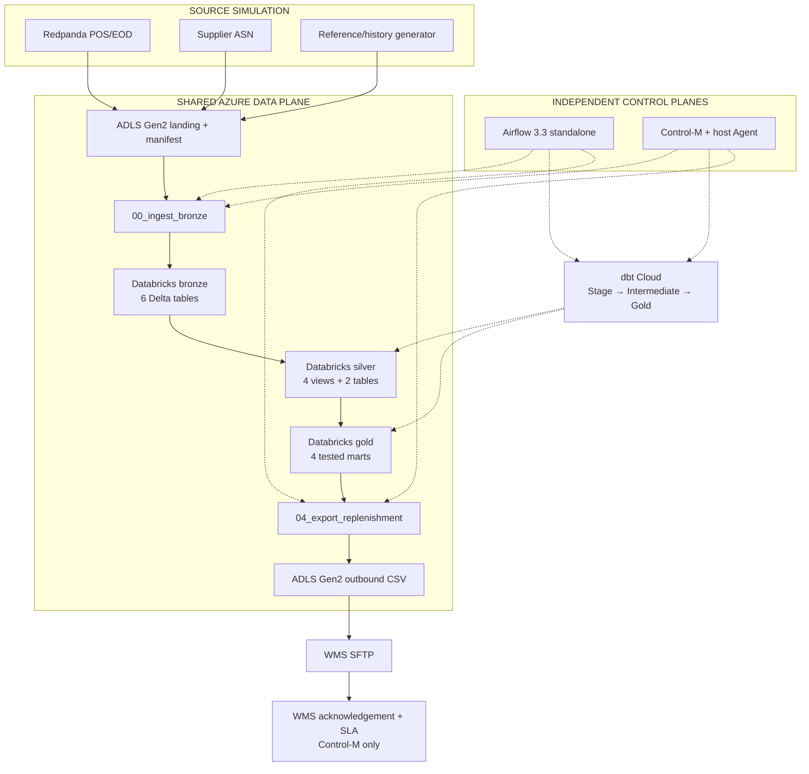

# Azure Databricks and dbt Cloud architecture decision

> **Status: implemented on the Databricks/dbt Cloud data-plane branch.**
>
> `docs/ARCHITECTURE.md` is the detailed as-built source of truth. This file
> records the target decision that replaced the transitional PostgreSQL design.

## Decision

Use Azure storage and Azure Databricks as the only persistent business-data
plane. dbt Cloud executes every transformation against Databricks. Remove the
local PostgreSQL schemas, Azurite boundary, local Databricks Jobs API surrogate,
Postgres-to-Delta sync and local dbt profile.

Keep Airflow and Control-M as independent orchestration paths over the same
implementation:

- both wait for store EOD readiness and the supplier ASN;
- both invoke the same stateless Kafka-to-Azure landing adapter;
- both invoke the same Azure Databricks ingest and export jobs;
- both invoke the same dbt Cloud Stage, Intermediate and Gold jobs; and
- both use the same WMS delivery adapter and deterministic order file.

Airflow ends at WMS delivery. Control-M continues through acknowledgement and the
06:00 business-service SLA. Airflow's embedded SQLite database is limited to its
own single-user control-plane metadata and is not a retail datastore.

## Resulting architecture



Bronze, Silver and Gold are Databricks schemas/objects, not components in a local
database:

| Layer | Owner | Physical result |
|---|---|---|
| Bronze | Azure Databricks ingest job | Six validated Delta source tables |
| Silver staging | dbt Cloud Stage job | Four views in Databricks `silver` |
| Silver intermediate | dbt Cloud Intermediate job | Two Delta tables in Databricks `silver` |
| Gold | dbt Cloud Gold job | Four tested marts in Databricks `gold` |

## Why this decision

The demo is aimed at an experienced data-engineering audience. A separate
PostgreSQL data plane created a bridge with no business value, made the Airflow
and Control-M comparison asymmetric, and obscured the role of the existing
Databricks notebooks. The implemented design gives every stage one clear owner:

- Redpanda and supplier generators simulate sources.
- ADLS Gen2 is the replayable transport boundary.
- Azure Databricks owns Spark/Delta ingestion and export.
- dbt Cloud owns SQL transformations and tests.
- Airflow and Control-M own orchestration and operational policy.
- WMS SFTP simulates downstream delivery/acceptance.

The comparison can therefore focus on orchestration capabilities rather than on
explaining two different business-data implementations.

## Implemented operator interface

The old local commands were removed. The manual shared chain is now:

```bash
make stage-inputs DATE=2026-08-14
make databricks-ingest DATE=2026-08-14
make dbt-stage DATE=2026-08-14
make dbt-intermediate DATE=2026-08-14
make dbt-gold DATE=2026-08-14
make databricks-export DATE=2026-08-14
make deliver DATE=2026-08-14
```

Provisioning is explicit through `make databricks-provision`,
`make dbt-cloud-publish` and `make dbt-cloud-provision`. Presentation runs use
`make demo-airflow` and `make demo-controlm`; neither target provisions or deploys
external services as an incidental step.
