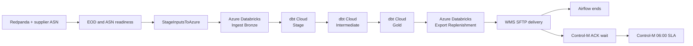

# Presentation runsheet — Airflow and Control-M over one data plane

Use trading date `2026-08-14`, an ordinary Friday for which the demo expects all
325 fictional stores. Never present the estate, thresholds, schedule or process as
Kmart production facts.

## Story to tell

The demo is **Trade Day Close to Store Replenishment**. Stores publish POS and EOD
events, a supplier publishes an ASN, Azure Databricks ingests the source contract,
dbt Cloud builds and tests Silver/Gold, Databricks exports an order, and a WMS
simulator receives it.

There is one implementation of that business flow. Airflow and Control-M are two
independent control planes over it:



Bronze, Silver and Gold are objects in Azure Databricks. PostgreSQL and the old
local Jobs API surrogate are not part of this architecture. Airflow's embedded
SQLite file contains only Airflow metadata.

## One-time preparation

Complete this before rehearsal, not in front of the audience:

```bash
make prepare
make install-databricks-cli
databricks auth login \
  --host https://WORKSPACE.azuredatabricks.net \
  --profile retail-demo-azure
make databricks-provision
make dbt-cloud-publish
make dbt-cloud-provision
make controlm-dbt-trust
make controlm-dbt-provision
make controlm-health
make controlm-build
make controlm-deploy
make up
make health
```

These steps create billable/external resources or mutate the connected Control-M
tenant. They are intentionally not hidden inside the live demo targets.

Verify these views without exposing secrets:

1. Airflow at `http://localhost:8080`.
2. Redpanda Console at `http://localhost:8081`.
3. Azure Databricks jobs `Retail Demo Ingest Bronze` and `Retail Demo Export
   Replenishment`.
4. Databricks schemas `bronze`, `silver` and `gold`.
5. dbt Cloud jobs `Retail Demo Stage`, `Retail Demo Intermediate` and `Retail
   Demo Gold`.
6. Control-M folder `TradeCloseToReplenishment`.

Never display `.env`, Databricks/dbt/Control-M authentication files, generated
runtime JSON or a token-bearing connection screen.

## Cold rehearsal

Run each control plane separately. Do not run them concurrently against the same
date because both intentionally replace the same deterministic targets.

Airflow:

```bash
make reset DATE=2026-08-14
make demo-airflow DATE=2026-08-14
```

Control-M:

```bash
make reset DATE=2026-08-14
make demo-controlm DATE=2026-08-14
```

Confirm the same remote job sequence and the same WMS filename in both runs. The
Control-M run should additionally finish `ConfirmWMSIntake` and `SLA_PickWave`.

## Live comparison sequence

### 1. Establish the shared data plane

Show `docs/ARCHITECTURE.md` and say:

> Azure storage and Azure Databricks are the only business-data plane. dbt Cloud
> owns transformations and tests. Airflow and Control-M schedule the same remote
> jobs; neither contains a second implementation.

Call out the physical mapping:

| Step | Physical result |
|---|---|
| `00_ingest_bronze` | Six `bronze` Delta tables |
| dbt `Stage` | Four views in `silver` |
| dbt `Intermediate` | Two Delta tables in `silver` |
| dbt `Gold` | Four tested marts in `gold` |
| `04_export_replenishment` | `REPLEN_ORDER_20260814.csv` in ADLS Gen2 |

### 2. Run Airflow

```bash
make reset DATE=2026-08-14
make seed DATE=2026-08-14
make eod-readiness-arm DATE=2026-08-14
make run-airflow DATE=2026-08-14
make simulate DATE=2026-08-14
```

In the Airflow graph, follow:

1. `validate_cloud_configuration`.
2. `wait_for_store_eod_threshold` and `wait_for_supplier_asn`.
3. `stage_inputs_to_azure`.
4. `databricks_ingest_bronze`.
5. `dbt_stage`, `dbt_intermediate`, `dbt_gold`.
6. `databricks_export_replenishment`.
7. `deliver_order_to_wms`.

Talking points:

- The two sensors reschedule rather than occupy workers while waiting.
- The DAG uses real Databricks and dbt Cloud providers.
- The generated job IDs refer to the same jobs used by Control-M.
- Airflow stops at delivery by design; it has completed the data-engineering
  responsibility represented in this comparison.

### 3. Run Control-M

After the Airflow run finishes:

```bash
make reset DATE=2026-08-14
make seed DATE=2026-08-14
make eod-readiness-arm DATE=2026-08-14
make run-controlm DATE=2026-08-14
make simulate DATE=2026-08-14
```

In Control-M Monitoring, follow:

1. `WaitForStoreEODThreshold` and `WaitSupplierASN` converge.
2. `StageInputsToAzure` writes the Azure manifest.
3. `IngestBronze` invokes the shared Databricks ingest job.
4. `DbtStage`, `DbtIntermediate`, and `DbtGold` invoke the shared dbt Cloud jobs.
5. `ExportReplenishment` invokes the shared Databricks export job.
6. `DeliverToWMS` transfers the same deterministic CSV.
7. `ConfirmWMSIntake` waits for the acknowledgement.
8. `SLA_PickWave` closes the wider business service.

Talking points:

- The BMC Event Handler translates the orchestrator-neutral Kafka readiness event
  into a Control-M event; it does not calculate the policy.
- The native ASN and ACK File Watchers expose non-arrival as distinct failures.
- Native `Job:DBT` tasks keep the dbt Cloud run visible in the wider service.
- Only Control-M spans through downstream acceptance and the 06:00 SLA.
- The comparison supports coexistence, not replacement.

## Expected source facts

| Source | Default count |
|---|---:|
| Product master | 2,000 |
| Stock positions | 26,000 |
| Sales history | 364,000 |
| POS transactions | 65,000 |
| Store EOD markers | 325 |
| ASN lines | 5,000 |

The landing manifest records headers, row counts and SHA-256 values. The ingest
notebook validates all six files before its first Delta write. Repeating the date
replaces the same whole-table or date-window targets.

## Failure demonstrations

Run one or two, not all of them, unless the session explicitly calls for a deep
operational workshop.

### Late stores

One missing store still proceeds with an exception:

```bash
make reset DATE=2026-08-14
make fail-1 STORES=1 DATE=2026-08-14
make eod-readiness-arm DATE=2026-08-14
make run-controlm DATE=2026-08-14
make simulate DATE=2026-08-14
```

Eight missing stores produce 317/325, below 98%, so no readiness event is emitted
and Control-M remains visibly waiting:

```bash
make reset DATE=2026-08-14
make fail-1 STORES=8 DATE=2026-08-14
make eod-readiness-arm DATE=2026-08-14
make run-controlm DATE=2026-08-14
make simulate DATE=2026-08-14
```

`make reset` releases the withheld active-generation markers. Stop or hold the
folder first if you want to preserve the failure for discussion.

### ASN schema drift

```bash
make reset DATE=2026-08-14
make fail-3 DATE=2026-08-14
make eod-readiness-arm DATE=2026-08-14
make run-controlm DATE=2026-08-14
make simulate DATE=2026-08-14
```

`IngestBronze` rejects the unexpected `carton_id` header before changing any
Bronze table for the attempted run.

### Negative stock quality gate

```bash
make reset DATE=2026-08-14
make seed DATE=2026-08-14
make fail-4 ROWS=400 DATE=2026-08-14
make eod-readiness-arm DATE=2026-08-14
make run-controlm DATE=2026-08-14
make simulate DATE=2026-08-14
```

Ingest accepts the structurally valid rows; the dbt accepted-range test fails in
`DbtIntermediate` and prevents Gold/export/delivery. This distinguishes transport
contracts from business-quality contracts.

### Downstream acceptance

```bash
make wms-never-ack
# run the Control-M flow and show ConfirmWMSIntake waiting

make wms-reject
# run again and show explicit downstream rejection
```

Airflow still ends at delivery in these scenarios; Control-M exposes downstream
acceptance as part of the service.

## Suggested 90-minute agenda

| Elapsed | Topic |
|---|---|
| 00:00–00:10 | Fictional business flow and shared-data-plane decision |
| 00:10–00:25 | Azure landing contract and Databricks Bronze/Silver/Gold |
| 00:25–00:40 | Airflow run and provider-native visibility |
| 00:40–01:00 | Control-M run, file boundaries and dbt Cloud jobs |
| 01:00–01:12 | WMS acknowledgement and SLA ownership |
| 01:12–01:23 | One failure/recovery exercise |
| 01:23–01:30 | Coexistence conclusion and questions |

## Restore and close

```bash
make reset DATE=2026-08-14
make wms-ack
make health
make down
```

`make down` retains local Kafka, WMS and Airflow metadata. Use `make clean` only
when deliberate deletion of those named volumes is intended.
